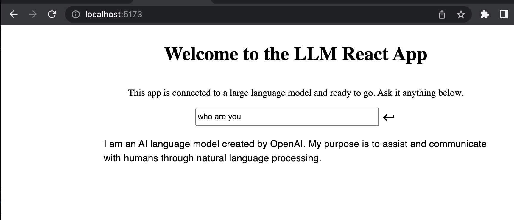

<h1 align='center' >
LLM React App Javascript Template 🪄
</h1>
<p align='center'>
    <a href='https://github.com/golivecosmos/pluto/blob/main/LICENSE'>
    
    </a>
  <a href='https://twitter.com/golivecosmos'>
    
  </a>
</p>

## What is an LLM React Node App Javascript Template?

This template is an example project for a simple Large Language Model (LLM) application built on top of React and Node. This template was built on top of [the React template app from nano-react-app](https://github.com/nano-react-app/template-js) and updated with a Node server that uses [LangChain.js](https://github.com/hwchase17/langchainjs) to connect to supported large language models, e.g. OpenAI and Hugging Face. Use this template to easily build and run an LLM app, like the screenshot below:



These are the available commands:

- `yarn start` — This will start a React development server for the frontend app, with a default port of `5173`.
- `yarn start-server` — This will start a Node development server for the backend app, with a default port of `3100`.

- `yarn build` — This will output a production build of the frontend app in the `dist` directory.
- `yarn preview` — This will run the production build of the frontend app locally with a default port of `5173` (_note_: this will not work if you haven't generated the production build yet).

## Getting Started

To get started, create a `.env` file by copying the `SAMPLE_env` file. Then, add your Open API key to the file.
Now you are ready to run the server and the web app.

## Custom port

You can use the `-p` flag to specify a port for development. To do this, you can either run `npm start` with an additional flag:

```bash
yarn start -- --port 3000
```

Or edit the `start` script directly:

```bash
vite --port 3000
```
